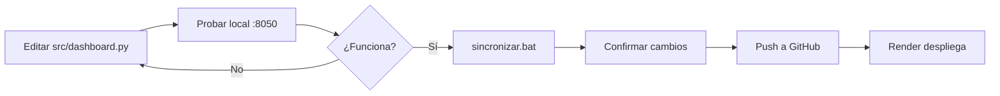

# 🔄 Flujo de Desarrollo y Producción

Este documento explica cómo trabajar en desarrollo local y sincronizar cambios a producción.

## 📁 Estructura de Trabajo

```
Visualizador_boletines/
├── src/              → DESARROLLO (editas aquí)
├── deploy/           → PRODUCCIÓN (se sincroniza automáticamente)
└── sincronizar.bat   → Script para pasar cambios a producción
```

## 🖥️ Desarrollo Local

### 1. Ejecutar Dashboard Localmente

**Opción A: Doble clic en `ejecutar_local.bat`**

**Opción B: Desde terminal:**
```bash
cd src
python dashboard.py
```

El dashboard estará disponible en: http://localhost:8050

### 2. Hacer Cambios

Edita los archivos en `src/`:
- `src/dashboard.py` - Para cambios en el dashboard
- `src/preprocesamiento.py` - Para cambios en procesamiento Excel→CSV
- `src/preprocesar_csv_a_parquet.py` - Para cambios en optimización

### 3. Probar Cambios

1. Guarda los cambios
2. Refresca el navegador (F5) 
3. El dashboard se recarga automáticamente con los cambios

## 🚀 Sincronizar a Producción

### Método 1: Con Confirmación (Recomendado)

**Doble clic en `sincronizar.bat`**

El script:
1. Detecta qué archivos cambiaron
2. Te muestra los cambios
3. Pide confirmación
4. Copia archivos a `deploy/`
5. Pregunta si quieres subir a GitHub
6. Sube cambios (Render despliega automáticamente)

### Método 2: Sincronización Rápida

```bash
python sincronizar_a_produccion.py --quick
```

Sincroniza y sube todo sin preguntar (útil cuando estás seguro).

### Método 3: Manual

```bash
# 1. Copiar dashboard
copy src\dashboard.py deploy\dashboard.py

# 2. Copiar datos (si cambiaron)
xcopy data\optimized\*.parquet deploy\datos_rapidos\ /Y
xcopy data\processed\*.csv deploy\datos_limpios\ /Y

# 3. Subir a GitHub
cd deploy
git add -A
git commit -m "Actualización"
git push origin master
```

## 📊 Actualizar Datos

Si tienes un nuevo Excel:

### 1. Procesar Excel

```bash
# Coloca el Excel en data/raw/
cd src
python preprocesamiento.py
python preprocesar_csv_a_parquet.py
```

### 2. Probar Localmente

```bash
python dashboard.py
# Verifica que todo funcione
```

### 3. Sincronizar a Producción

```bash
cd ..
sincronizar.bat
```

## 🔍 Verificación

### Dashboard Local
- URL: http://localhost:8050
- Archivos: `src/dashboard.py`
- Datos: `data/processed/` y `data/optimized/`

### Dashboard Producción
- GitHub: https://github.com/gbreard/visualizador-boletines
- Render: Se despliega automáticamente al hacer push
- Archivos: `deploy/`

## 📝 Flujo Típico de Trabajo



## 🛠️ Comandos Útiles

### Ver cambios pendientes
```bash
python sincronizar_a_produccion.py --status
```

### Solo sincronizar archivos (sin Git)
```bash
python sincronizar_a_produccion.py --no-git
```

### Revertir cambios en deploy
```bash
cd deploy
git checkout -- .
```

## ⚠️ Notas Importantes

1. **SIEMPRE prueba localmente** antes de sincronizar
2. **Los cambios en `deploy/` se pierden** - siempre edita en `src/`
3. **Render despliega automáticamente** al detectar cambios en GitHub
4. **El script ajusta rutas automáticamente** (../data → datos_limpios)

## 🔧 Troubleshooting

### Dashboard local no carga
- Verifica que estés en `src/`: `cd src`
- Verifica dependencias: `pip install -r ../requirements.txt`

### Sincronización falla
- Verifica que existan las carpetas `src/` y `deploy/`
- Ejecuta desde el directorio raíz del proyecto

### GitHub rechaza push
- Haz pull primero: `cd deploy && git pull origin master`
- O fuerza el push: `git push --force origin master`

### Render no despliega
- Verifica en https://dashboard.render.com
- Revisa logs de deploy en Render
- Asegúrate que `requirements.txt` esté actualizado

## 📞 Ayuda

Si tienes problemas:
1. Revisa `docs/GEMINI.md` para documentación técnica
2. Verifica logs en la terminal
3. Revisa el dashboard de Render para errores de deploy

---

**Recuerda**: Desarrollo en `src/` → Prueba local → `sincronizar.bat` → Producción automática